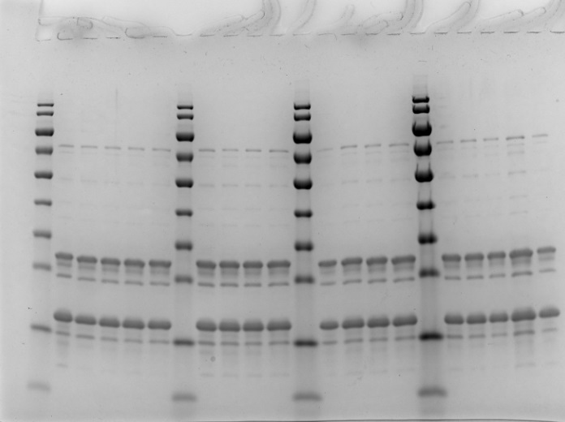

  <!-- Replace with your image filename and adjust the path if needed -->

This repository contains Python scripts and data analysis for generating SDS-PAGE integration plots. The project focuses on:
- Data loading and cleaning
- Multiple visualization methods (bubble charts, scatter plots, box plots, and heatmaps)
- Exporting plots as images

## Getting Started

1. Clone this repository.
2. Install the required Python packages:
   ```
   pip install pandas matplotlib seaborn numpy
   ```
3. Run the Python scripts to reproduce the analyses and plots.

## Repository Structure

- `plot_His-Enz-TEV-cleavage.py` - Main script for data analysis and plotting.
- `images/` - Folder containing reference images and exported plots.
- `cleaved_data_export.csv` - Example exported data file.

Enjoy exploring the project!

Details note: In this repository are a python code (.py file) where you paste in Band %, Lane % of a protein detected with total protein stain e.g. commassie, silver. The results can be many lane results integrated in for example using Image Lab at different pH, salt and a additive e.g. Urea. Program then computes plots of the combined effect as the three variables (if any).

Summary: Python code where you paste in Band %, Lane % of a protein detected, plots of the combined effect as the three variable


